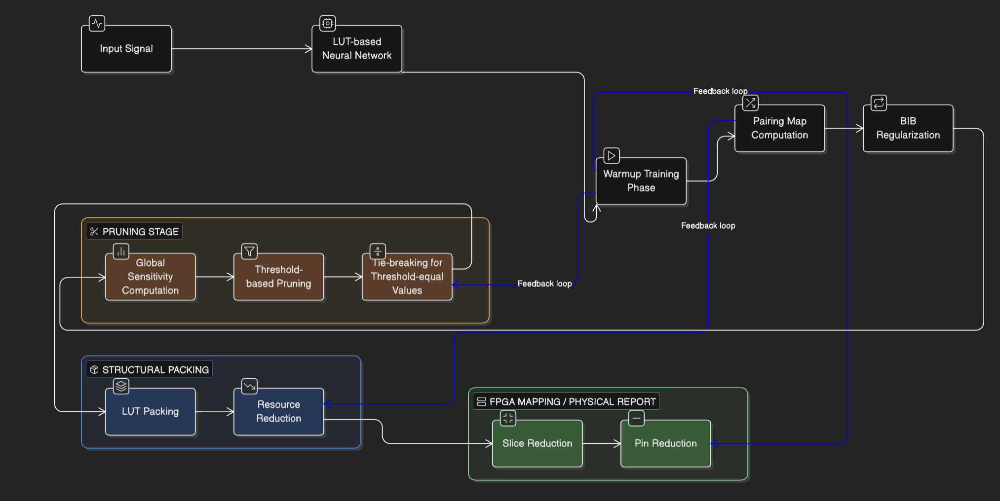
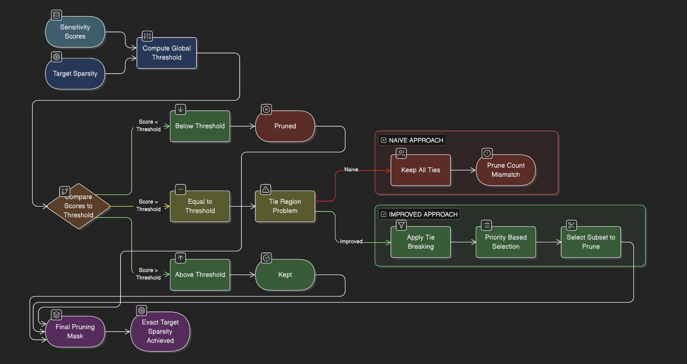
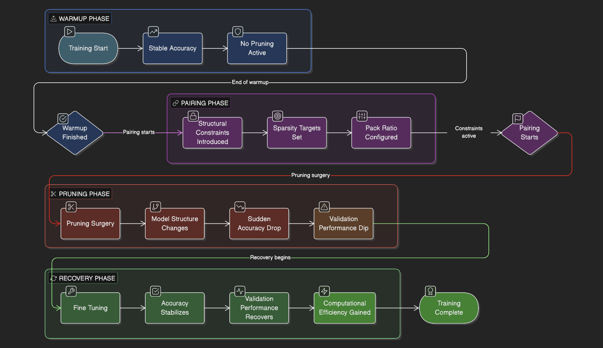
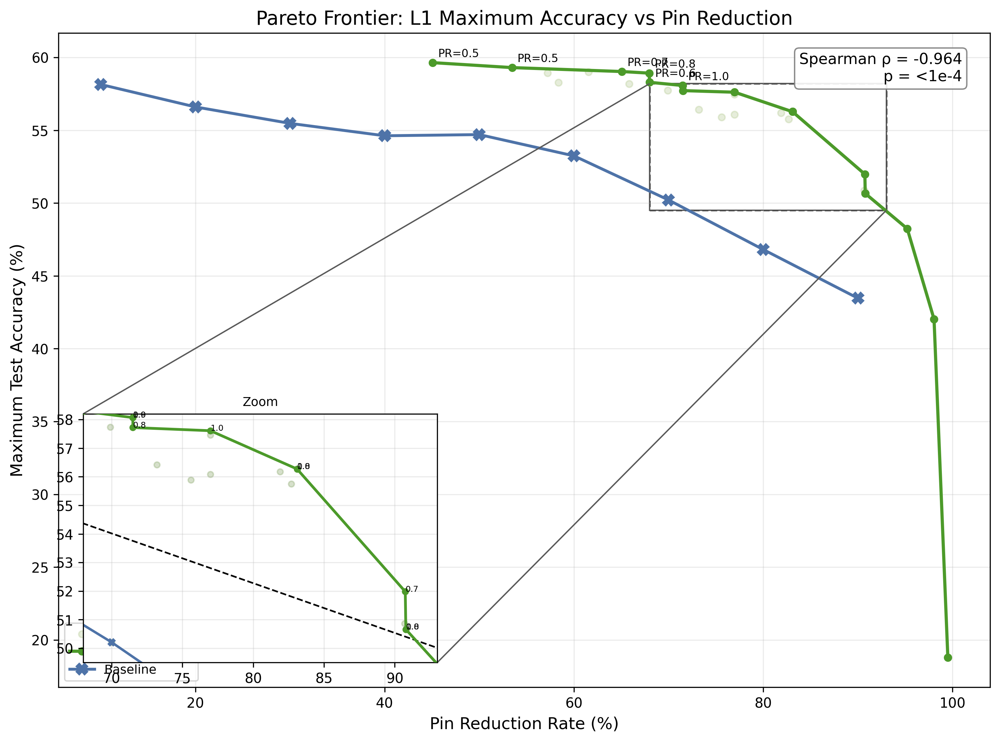
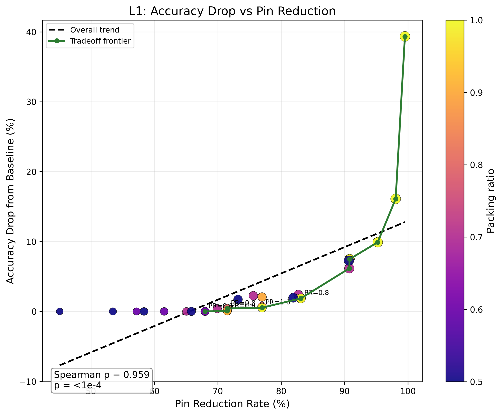
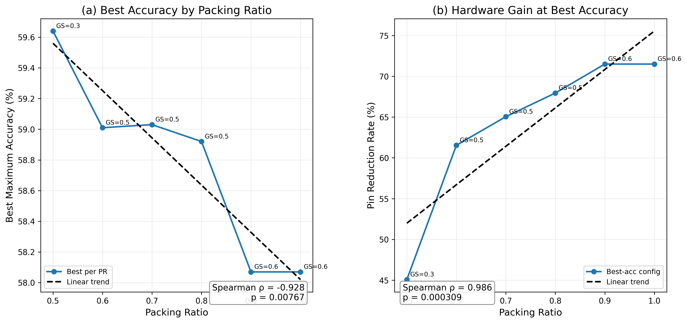

# LutNet: Hardware-Aware Pruning and FPGA Efficiency

This project explores hardware-aware training and pruning strategies for LUT-based neural networks, with the goal of achieving efficient FPGA deployment while maintaining strong classification performance.

Unlike conventional neural network optimization, this work focuses on **bridging the gap between algorithmic pruning and hardware realization**, particularly under LUT constraints.

---

# 1. Motivation

Traditional neural network pruning methods focus on reducing parameter count or improving sparsity. However, these approaches do not necessarily translate to actual hardware efficiency.

In FPGA-based systems:
- Resource usage (LUTs, slices, routing) is not directly proportional to parameter count
- Structural constraints (e.g., LUT packing) significantly affect efficiency
- Global pruning decisions can introduce instability in both accuracy and hardware mapping

This project addresses these gaps by analyzing and improving pruning behavior under hardware constraints.

---

# 2. Core Objectives

The project is built around three key goals:

### (1) Understand LUT-based neural network training pipeline
- Analyze how LUT layers replace MAC operations
- Understand training flow including warmup, pairing, and pruning

### (2) Identify and debug pruning instability
- Investigate global threshold-based pruning behavior
- Analyze failure cases caused by sensitivity value ties

### (3) Evaluate hardware-aware trade-offs
- Study relationship between accuracy and FPGA resource usage
- Analyze impact of pruning on slice and pin reduction

---

# 3. Pipeline Overview

The training pipeline consists of the following stages:

### 3.1 LUT-based Neural Network
- Replaces traditional MAC operations with LUT-based computation
- Enables efficient mapping onto FPGA logic blocks

### 3.2 Warmup Training Phase
- Model is trained without pruning
- Establishes stable baseline performance

### 3.3 Pairing & Structural Regularization
- Introduces structural constraints between channels
- Uses BIB (Bi-directional Interaction Based) regularization

### 3.4 Pruning Stage
- Computes sensitivity scores for each input
- Applies global threshold-based pruning
- Introduces tie-breaking to resolve threshold ambiguity

### 3.5 Structural Packing
- Groups pruned inputs into LUT structures
- Optimizes mapping efficiency

### 3.6 FPGA Mapping / Physical Report
- Evaluates:
  - Slice reduction
  - Pin reduction
- Measures actual hardware efficiency

---

# 4. Key Problem: Global Threshold Instability

One of the most important findings in this project is:

> **Naive global threshold pruning is unstable in practice**

---

## 4.1 Root Cause

Many sensitivity values are **exactly equal** (due to quantization-like behavior).

This creates a "tie region" at the threshold.

---

## 4.2 Naive Approach Failure

Naive pruning:
- Keeps all values ≥ threshold
- Does not explicitly handle ties

Result:
- Target sparsity is NOT achieved
- Prune count mismatch occurs

---

## 4.3 Improved Solution: Tie-Breaking

We introduce an explicit tie-breaking mechanism:

- Identify elements equal to threshold
- Select a subset to prune
- Ensure exact target prune count

This leads to:
- Stable pruning behavior
- Accurate sparsity control
- Better alignment with hardware constraints

---

# 5. Training Behavior Analysis

Training follows a non-trivial pattern:

### Phase 1: Warmup
- Stable accuracy
- No pruning applied

### Phase 2: Pruning Activation
- Structural change occurs
- Sudden accuracy drop

### Phase 3: Recovery
- Model adapts to new structure
- Accuracy stabilizes

---

## Key Insight

> Pruning is not a smooth optimization process —  
> it introduces a **discrete structural shift**.

---

# 6. Hardware-Aware Trade-off

---

## 6.1 Accuracy vs Pin Reduction

- Shows trade-off between:
  - Model accuracy
  - Hardware efficiency

---

## 6.2 Accuracy Drop vs Resource Reduction

- Increasing pruning leads to:
  - More resource savings
  - But larger accuracy degradation

---

## 6.3 Pack Ratio Analysis

- Different pack ratios affect:
  - Model performance
  - Hardware utilization

---

# 7. Analysis Code

All analysis in this project is supported by custom Python scripts.

---

## 7.1 check_pruning_consistency.py

Purpose:
- Detect instability in global pruning

Key Features:
- Analyzes threshold ties
- Compares:
  - Target prune count
  - Actual prune count
- Implements improved tie-breaking logic

---

## 7.2 compare_packratio_runs.py

Purpose:
- Compare multiple experimental runs

Key Features:
- Evaluates accuracy vs pack ratio
- Supports trade-off visualization

---

## 7.3 parse_train_log.py

Purpose:
- Extract structured data from raw training logs

Key Features:
- Parses:
  - accuracy
  - loss
  - pruning events
- Enables training phase analysis

---

## 7.4 l1_paper_figures.py

Purpose:
- Generate analysis figures

Key Features:
- Produces:
  - distribution plots
  - comparison graphs
- Used for paper-style visualization

---

# 8. Results

---

## 8.1 lutnet_summary_metrics.csv

Contains:
- Accuracy
- Slice reduction
- Pin reduction

---

## 8.2 log_comparison_table.csv

Contains:
- Run-level comparison
- Different pruning configurations

---

## 8.3 threshold_check_summary.txt

Contains:
- Pruning consistency analysis
- Threshold tie statistics

---

# 9. Key Insights

### Insight 1
Global threshold pruning fails when many values are tied.

---

### Insight 2
Exact sparsity control requires explicit tie-breaking.

---

### Insight 3
Pruning introduces structural discontinuity in training.

---

### Insight 4
Hardware efficiency is not directly correlated with sparsity.

---

# 10. Future Directions

- Structure-aware pruning (channel-level / block-level)
- Alternative architectures (CNN, ResNet)
- Extension to RadioML classification
- Improved FPGA mapping strategies

---

# 11. Summary

This project demonstrates that:

> Hardware-aware optimization requires more than standard pruning techniques.

By combining:
- pruning analysis
- tie-breaking strategies
- hardware-aware evaluation

we move closer to practical deployment of LUT-based neural networks.
