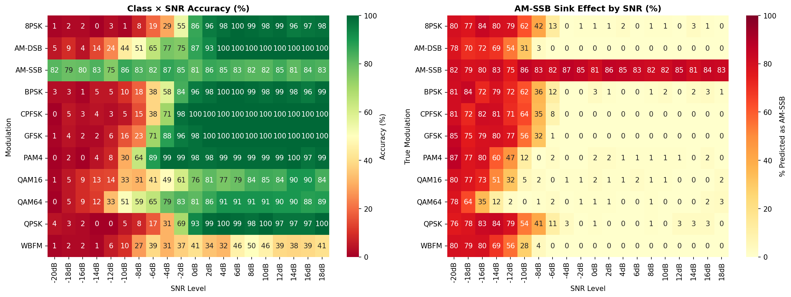
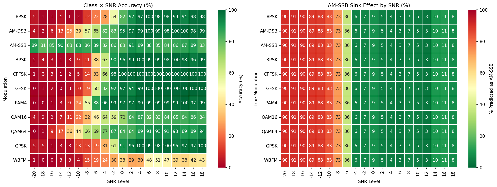
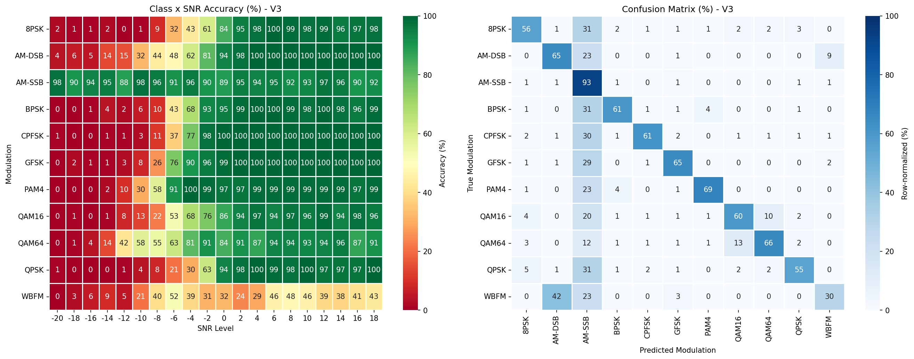

# RadioML: CNN-Based Modulation Classification and Representation Analysis

This project explores modulation classification on the RadioML dataset using CNN-based architectures, with the goal of understanding how signal representation and model structure affect performance under noisy conditions.

Unlike standard accuracy-focused classification experiments, this work emphasizes **structured failure analysis**, feature representation, and branch-based modeling to understand why certain classes remain difficult even when overall accuracy appears reasonable.

---

# 1. Motivation

Radio signal classification is challenging because performance depends not only on the model architecture, but also on how the signal is represented.

In the RadioML setting:
- input signals are short IQ sequences rather than images or text
- performance varies significantly across SNR conditions
- some classes remain difficult even when others are classified well
- raw IQ signals may not expose frequency-related structure clearly enough for a baseline CNN

This project investigates these issues by building baseline and branch-based CNN models, then analyzing their failure patterns in detail.

---

# 2. Core Objectives

The project is built around three key goals:

### (1) Establish a baseline CNN on RadioML
- Train a standard 1D CNN on raw IQ signals
- Use it as a reference point for later experiments

### (2) Analyze structured model failure
- Study class-wise and SNR-wise accuracy
- Identify persistent confusion patterns and bottleneck classes

### (3) Test whether explicit frequency-aware features help
- Add instantaneous-frequency-based input variants
- Compare baseline and branch-based architectures

---

# 3. Problem Setup

The task is modulation classification using RadioML IQ samples.

### Input
- IQ signal sequence
- shape typically adapted to `[B, 2, 128]`

### Output
- predicted modulation class

The dataset includes multiple analog and digital modulation types, and performance depends strongly on SNR level.

---

# 4. Baseline Model

The baseline model is a standard 1D CNN operating directly on raw IQ input.

The network uses:
- stacked Conv1d layers
- BatchNorm1d
- ReLU
- MaxPool1d
- fully connected classifier layers

The baseline serves two roles:
- provide a reference accuracy
- reveal which failure modes are structural rather than incidental

---

# 5. Key Problem: Structured Failure in RadioML Classification

One of the most important findings in this project is:

> **The baseline CNN does not fail randomly; it fails in highly structured ways.**

---

## 5.1 Low-SNR Collapse

At low SNR, overall performance drops sharply.

This indicates that the baseline CNN struggles to preserve useful signal structure under heavy noise.

---

## 5.2 AM-SSB Sink Behavior

In difficult cases, the model tends to over-predict AM-SSB.

This means AM-SSB behaves like a sink class: when uncertainty is high, many other samples collapse into that prediction.

---

## 5.3 WBFM Misclassification

WBFM is one of the most difficult classes.

A major observed pattern is:
- WBFM is often misclassified as AM-DSB
- this happens systematically rather than randomly

This suggests that raw IQ input may not make frequency-related structure explicit enough for the baseline CNN.

---

# 6. Frequency-Aware Experiments

To address the limitations of raw IQ input, the project explores explicit frequency-related representations.

---

## 6.1 Instantaneous Frequency (IF) Input

The IF-based experiment adds a derived frequency-related feature to test whether making phase/frequency behavior more explicit improves performance.

The motivation is:

- raw IQ contains phase/frequency information implicitly
- the baseline CNN may not extract that information effectively
- explicit IF may help the model separate difficult modulation classes

---

## 6.2 Branch-Based Model (V3)

The branch-v3 model introduces a modified architecture to process richer feature structure more effectively.

Rather than relying on a single path to learn all signal characteristics, this model tests whether architectural separation improves robustness and classification behavior.

---

## 6.3 Branch-Based Model (V3+)

If available, additional branch variants can be compared in the same framework to test whether further structural refinement improves:
- low-SNR robustness
- difficult-class performance
- overall consistency across SNR levels

---

# 7. Analysis Code

All major conclusions in this project are supported by custom analysis scripts.

---

## 7.1 analyze_model_detailed.py

Purpose:
- Perform detailed baseline evaluation

Key Features:
- class-wise breakdown
- SNR-wise breakdown
- heatmap-oriented outputs

---

## 7.2 analyze_ifreq.py

Purpose:
- Evaluate the IF-based experiment

Key Features:
- compares IF-based model behavior against baseline
- generates summary metrics and heatmaps

---

## 7.3 analyze_branch_v3.py

Purpose:
- Evaluate branch-v3 experiments

Key Features:
- analyze accuracy changes by class and SNR
- compare performance against baseline and IF variants

---

## 7.4 analyze_confidence_and_failure.py

Purpose:
- Study prediction confidence and error structure

Key Features:
- separates correct and incorrect predictions
- helps interpret whether errors are ambiguous or systematic

---

# 8. Results

---

## 8.1 analysis_summary.txt

Contains:
- baseline summary metrics
- class/SNR evaluation outputs

---

## 8.2 analysis_summary_branch_v3.txt

Contains:
- branch-v3 evaluation summary
- comparison against baseline

---

## 8.3 analysis_summary_ifreq.txt

Contains:
- IF experiment summary
- feature-based performance observations

---

## 8.4 analysis_tables.csv

Contains:
- compact experiment metrics
- table-friendly summaries for comparison

---

# 9. Key Insights

### Insight 1
Overall accuracy is not enough; class- and SNR-level analysis is necessary.

---

### Insight 2
Failure patterns are structured, not random.

---

### Insight 3
Raw IQ input is not always sufficient to expose frequency-related distinctions.

---

### Insight 4
Architecture and representation both matter; simply adding a feature does not guarantee improvement.

---

# 10. Future Directions

- stronger multi-branch architectures
- more explicit phase/frequency modeling
- improved low-SNR robustness
- ResNet-style 1D CNN variants
- tighter connection to hardware-aware model design explored in LutNet

---

# 11. Summary

This project demonstrates that:

> Modulation classification performance depends not only on network capacity, but also on how signal structure is represented and analyzed.

By combining:
- baseline CNN training
- structured failure analysis
- frequency-aware feature experiments
- branch-based architectures

this work moves from simple model benchmarking toward a deeper understanding of representation bottlenecks in signal classification.
